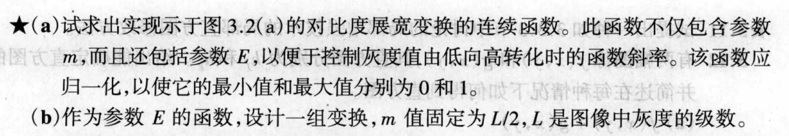
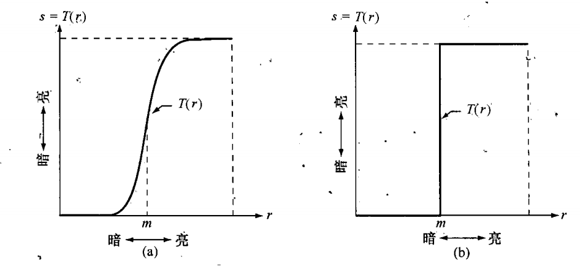
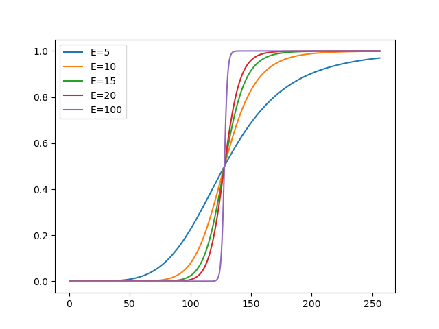
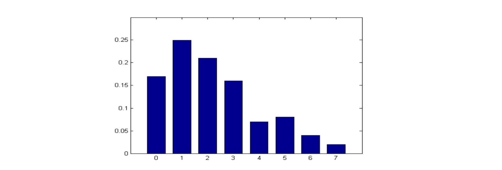
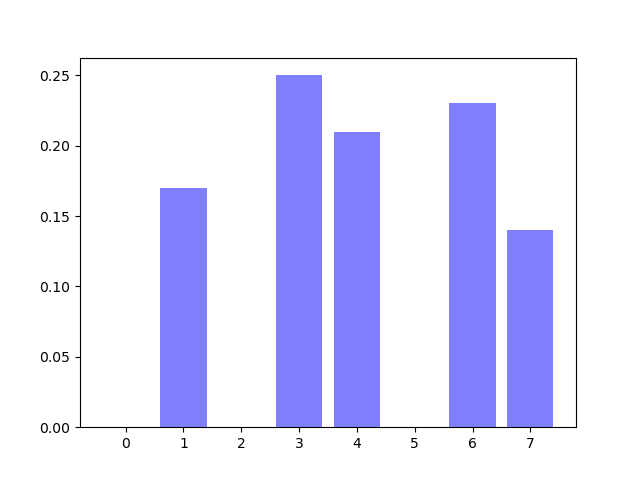
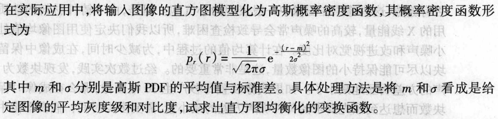
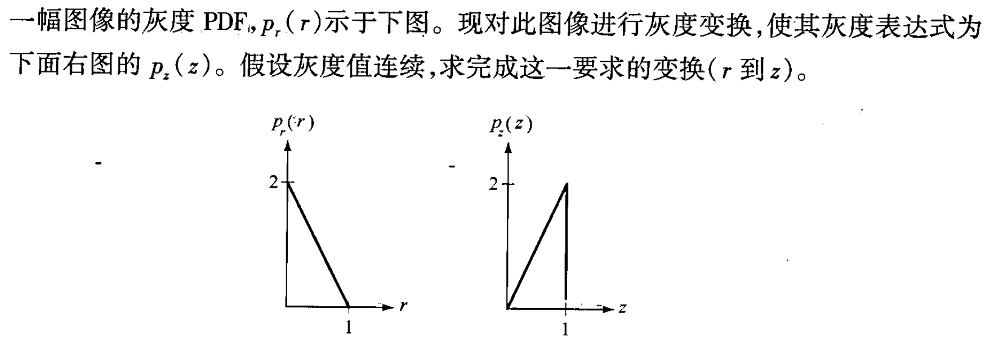
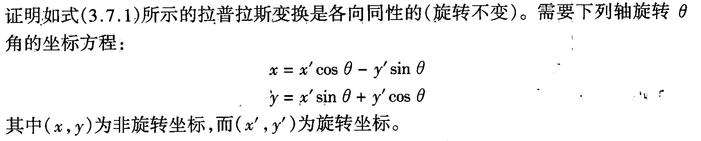
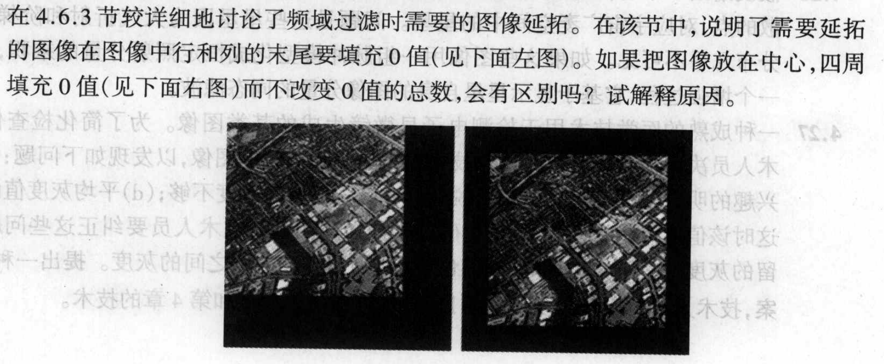

# 图像处理 HW1

## 1

> 
>
> 

### (a)

$$
S = \frac{1}{(1+m/r)^E}
$$

### (b)

我们取$L=256$，画出$E=5,10,15,20,100$时的变换曲线如下：

## 2

> 一幅8灰度级图像具有如下所示的直方图，求直方图均衡后的灰度级和对应概率，并画出均衡后的直方图的示意图。（图中的8个不同灰度级对应的归一化直方图为[0.17  0.25  0.21  0.16  0.07  0.08  0.04  0.02]）
>
> 

* 求解累计概率

  * $p_0 = P_0=0.17$
  * $p_1 = P_1+S_0=0.25+0.17=0.42$
  * $p_2 = P_2+S_1 =0.21+  0.42=0.63$
  * $p_3 = P_3 + S_2=0.16+0.63 = 0.79$
  * $p_4 = P_4 + S_3 = 0.07+0.79 =0.86$
  * $p_5= P_5+S_4 = 0.08+0.86 =0.94$
  * $p_6 = P_6+S_5 = 0.04+0.94=0.98$
  * $p_7 = P_7+S_6 = 0.02+0.98=1$

  通过累计概率，我们可以逐步得到：

  * $S_0 = p_0\times 7 = 1.19\approx 1$
  * $S_1=p_1\times7=2.94\approx 3$
  * $S_2 = p_2\times 7 = 4.41\approx 4$
  * $S_4 = p_3\times 7 = 5.53\approx 6$
  * $S_4 = p_4\times 7 = 6.02\approx 6$
  * $S_5 = p_5\times 7 = 6.58\approx 7$
  * $S_6 = p_6\times 7 = 6.86\approx 7$
  * $S_0 = p_7\times 7 = 7$

  因此，我们就可以计算出均衡后的灰度级和对应概率：

  | 灰度级 | 0    | 1    | 2    | 3    | 4    | 5    | 6    | 7    |
  | ------ | ---- | ---- | ---- | ---- | ---- | ---- | ---- | ---- |
  | 概率   | 0 | 0.17| 0 | 0.25 | 0.21 | 0 |0.23| 0.14 |
  
  其对应直方图如下：
  
  

## 3

> 

设最大灰度级为$L$，则：
$$
s=T(r) = (L-1)\int_0^rp_r(w)d(w) = \frac{L-1}{\sqrt{2\pi}\sigma}\int_0^re^{-\frac{(w-m)^2}{2\sigma^2}} d(w)
$$

## 4

> 

通过图像可知两个灰度表达式的解析式：
$$
p_r(r) = -2r+2\\
p_z(z) = 2z
$$
随后分别求解转换函数
$$
T(r) = \int_0^r(-2w+2)dw = -r^2+2r \\
G(z) = \int_0^z2zdz=z^2
$$
我们发现$G^{-1}(w) = \sqrt{w}$，所以可得：
$$
z = G^{-1}(T(r)) = \sqrt{-r^2+2r}
$$

## 5

> 请计算如下两个向量与矩阵的卷积计算结果。
>
> (1) $\begin{bmatrix}1\ 2\ 3\ 4\ 5\ 4\ 3\ 2\ 1\end{bmatrix} \star \begin{bmatrix}2\ 0\ -2\end{bmatrix}$
>
> (2) $\begin{bmatrix}-1 \ 0\ 1 \\ -2 \ 0 \ 2 \\-1 \ 0\ 1\end{bmatrix}\star \begin{bmatrix}1 \ 3\ 2\ 0\ 4 \\ 1\ 0 \ 3\ 2\ 3 \\0 \ 4\ 1\ 0\ 5 \\ 2\ 3\ 2\ 1\ 4\\ 3\ 1\ 0\ 4\ 2\end{bmatrix}$

卷积计算需要将规模小的在规模大的矩阵中滑动

### (1)

$$
conv[i]=\sum_{j=0}^2a[i+j]\times b[j]\\
conv =\begin{bmatrix}4, 4, 4, 0, -4, -4, -4\end{bmatrix}
$$

### (2)

$$
conv[i][j] = \sum_{p=0}^2\sum_{q=0}^2b[i+p][j+q]\times a[i][j] \\
conv=\begin{bmatrix}-6,3,-6 \\ -4,8,-10 \\2, 5, -10 \end{bmatrix}
$$

## 6

> 

拉普拉斯算子可以表示为：
$$
\nabla f=\frac{\partial^2 f}{\partial x^2}+\frac{\partial^2 f}{\partial y^2}
$$
根据变换公式可得：
$$
\frac{\partial f}{\partial x'}=\frac{\partial f}{\partial x}\frac{\partial x}{\partial x'}+\frac{\partial f}{\partial y}\frac{\partial y}{\partial x'}=\frac{\partial f}{\partial x}cos\theta+\frac{\partial f}{\partial y}sin\theta \\
\frac{\partial f}{\partial y'}=\frac{\partial f}{\partial x}\frac{\partial x}{\partial y'}+\frac{\partial f}{\partial y}\frac{\partial y}{\partial y'}=-\frac{\partial f}{\partial x}sin\theta+\frac{\partial f}{\partial y}cos\theta
$$
再次微分可得
$$
\begin{align}
\frac{\partial^2 f}{\partial x’^2}&=\frac{\partial}{\partial x}(\frac{\partial f}{\partial x}cos\theta+\frac{\partial f}{\partial y}sin\theta)\frac{\partial x}{\partial x'}+\frac{\partial}{\partial y}(\frac{\partial f}{\partial x}cos\theta+\frac{\partial f}{\partial y}sin\theta)\frac{\partial y}{\partial x'} \\
&=\frac{\partial^2 f}{\partial x^2}cos^2\theta+2\frac{\partial^2 f}{\partial x \partial y}cos\theta sin\theta +\frac{\partial^2 f}{\partial y^2}sin^2\theta \\

\frac{\partial^2 f}{\partial y'^2}&=\frac{\partial}{\partial x}(-\frac{\partial f}{\partial x}sin\theta+\frac{\partial f}{\partial y}cos\theta)\frac{\partial x}{\partial y'}+\frac{\partial}{\partial y}(-\frac{\partial f}{\partial x}sin\theta+\frac{\partial f}{\partial y}cos\theta)\frac{\partial y}{\partial y'} \\
&=\frac{\partial^2 f}{\partial x^2}sin^2\theta-2\frac{\partial^2 f}{\partial x \partial y}cos\theta sin\theta +\frac{\partial^2 f}{\partial y^2}cos^2\theta
\end{align}
$$
由此可知
$$
\frac{\partial^2 f}{\partial x’^2}+\frac{\partial^2 f}{\partial y’^2}=\frac{\partial^2 f}{\partial x^2}+\frac{\partial^2 f}{\partial y^2}
$$

## 7

> 根据书中对傅立叶变换的定义，证明课本165页上有关傅立叶变换的平移性质。

首先证明：$f(x, y)e^{j2\pi(u_0x/M+v_0y/N)}\Longleftrightarrow F(u-u_0, v-v_0)$
$$
\begin{align}
\mathcal{F}(f(x, y)e^{j2\pi(u_0x/M+v_0y/N)}) &=\frac{1}{MN}\sum_{x=0}^{M-1}\sum_{y=0}^{N-1}f(x,y)e^{-j2\pi((u-u_0)x/M+(v-v_0)y/N)}\\
&= F(u-u_0, v-v_0)
\end{align}
$$
再来证明：$f(x-x_0, y-y_0)\Longleftrightarrow F(u, v)e^{-j2\pi(x_0u/M+y_0v/N)}$
$$
\begin{align}
\mathcal{F}^{-1}(F(u, v)e^{-j2\pi(x_0u/M+y_0v/N)}) &=\sum_{u=0}^{M-1}\sum_{v=0}^{N-1}F(u,v)e^{j2\pi((x-x_0)u/M+(y-y_0)v/N)}\\
&= f(x-x_0, y-y_0)
\end{align}
$$
对于表中平移的两个特例，只需要关注到
$$
e^{j\pi}=-1
$$
就可以根据已经证明的结果得到特例

## 8

> 观察如下所示图像。右边的图像这样得到：(a)在原始图像左边乘以$(-1)^{x+y}$；(b) 计算离散傅里叶变换(DFT); (c) 对变换取复共轭; (d) 计算傅里叶反变换; (d) 结果的实部再乘以$(-1)^{x+y}$。(用数学方法解释为什么会产生右图的效果。)
>
> 

第一步，我们将原始图像左边乘以$(-1)^{x+y}$：

$$
f'(x, y) = f(x, y)\times (-1)^{x+y}
$$

第二步，我们计算离散傅里叶变换：

$$
\begin{align}
F(u, v) &= \frac1{MN}\sum_{x=0}^{M-1}\sum_{y=0}^{N-1}f'(x, y)e^{-j2\pi(ux/M+vy/N)} \\
&= \frac1{MN}\sum_{x=0}^{M-1}\sum_{y=0}^{N-1}f(x, y)e^{-j2\pi((u-M/2)x/M+(v-N/2)y/N)} \\
&= F(u-M/2, v-N/2)
\end{align}
$$

第三步，我们对变换取复共轭：

$$
F^*(u - M/2, v - N/2) = F(-u + M/2, -v + N/2)
$$

第四步，我们计算傅里叶反变换。这里我们令$a = u - M/2, b = v - N/2$：

$$
\begin{align}
f''(x, y) &= \sum_{u=0}^{M-1}\sum_{v=0}^{N-1}F^*(u - M/2, v - N/2)e^{j2\pi(ux/M+vy/N)} \\
&= \sum_{u=0}^{M-1}\sum_{v=0}^{N-1}F(a, b)e^{-j2\pi((a-M/2)x/M+(b-N/2)y/N)} \\
&= \sum_{u=0}^{M-1}\sum_{v=0}^{N-1}F(a, b)e^{-j2\pi(ax/M+by/N)}e^{j\pi(x+y)} \\
&= f(-x, -y) \times (-1)^{x+y}
\end{align}
$$

这里有一个需要注意的是，虽然求和上下限是$0$到$M-1$，但事实上这是因为在小于$0$和大于$M-1$的部分$F(u, v)$为$0$，所以变量代换事实上没有对真实的上下限（正无穷和负无穷）产生影响。

第五步，我们将结果的实部再乘以$(-1)^{x+y}$：

$$
f'''(x, y) = f''(x, y) \times (-1)^{x+y} = f(-x, -y)
$$

这个结果表明，图像相对于原始图像是关于中心对称的，这也就解释了为什么会产生右图的效果。

## 9

> 高斯型低通滤波器在频域中的传递函数是
> $$
> H(u,v)=Ae^{-(u^2+v^2)/2\sigma^2}
> $$
> 根据二维傅里叶性质，证明空间域的相应滤波器形式为
> $$
> h(x,y)=A2\pi \sigma^2e^{-2\pi^2\sigma^2(x^2+y^2)}
> $$
> （这些闭合形式只适用于连续变量情况。）

根据已知傅里叶变换：
$$
e^{-\pi(x^2+y^2)}\Longleftrightarrow e^{-\pi(u^2+v^2)}
$$
可以带入傅里叶变换的比例变换：
$$
cf(ax, by)\Longleftrightarrow \frac{c}{|ab|}F(\frac{u}{a}, \frac{v}{b})
$$
那么只需要令$c=2A\pi\sigma^2, a=b=\sqrt{2\pi}\sigma$，带入已知的传递函数即可得到：
$$
A2\pi\sigma^2e^{-2\pi^2\sigma^2(x^2+y^2)}\Longleftrightarrow Ae^{-(u^2+v^2)/2\sigma^2}
$$

可以看到，左式正是$h(x, y)$的形式，右式正是$H(u, v)$的形式，因此证明了这个结论。

## 10

> 

不会有区别。图像延拓本质上是为了防止图像的周期性引发错误的卷积结果，故而在图像的边缘加入了一部分缓冲区。如果将左图沿着X和Y方向无限重复，其结果将是一个以黑色边缘的棋盘格子，与右图在X和Y方向无限延拓的结果是完全一致的，黑色边缘的大小也是一致的，二者无法区分，因此在做频域滤波时结果也是一致的。

## 11

> 假设我们有一个[0，1]上的均匀分布随机数发生器U(0,1), 请基于它构造指数分布的随机数发生器，推导出随机数生成方程。若我们有一个标准正态分布的随机数发生器N(0,1)，请推导出对数正态分布的随机数生成方程。

### (1)

已知指数分布的概率密度函数是$f(x)=\lambda e^{-\lambda x}(x \ge 0, \lambda > 0)$,分布函数为$F(x)=1-e^{-\lambda x}(x \ge 0, \lambda>0)$。

假设$Y\sim U(0, 1)$，我们希望构造$X=g(Y)$，使得$X$服从指数分布，那么我们就可以得到：
$$
F(X)=Y
$$
带入指数分布的分布函数，我们可以整理得到
$$
X=-\frac 1\lambda ln(1-Y)
$$
由于$1-Y$也服从$U(0,1)$，故令$Z=1-Y\sim U(0, 1)$：
$$
X=-\frac 1\lambda ln(Z)
$$

### (2)

已知若$X\sim N(\mu, \sigma)$，则$Y=e^X$服从对数正态分布

已知我们现在有$Z\sim N(0,1)$，那么我们希望构造$Y=N(\mu, \sigma)$。根据正态分布性质可知$Y$和$Z$的关系是：
$$
Y=\mu+\sigma Z
$$
再次使用$Y$构造服从对数正态分布的随机变量$X$：
$$
X = e^Y
$$
故随机数生成方程为：
$$
X=e^{\mu+\sigma Z}
$$

## 12

> 请证明第二版课本习题4.5中提及的频域内高通滤波器与低通滤波器的关系式子。

书中的定义提到，低通滤波器的衰减频率能通过高通滤波器，低通滤波器应该和高通滤波器构成互补频谱，也就是说，对频域内$\forall u,v$，若有$H_{LP}(u, v)=k, k\in [0,1]$,则必有$H_{HP}(u, v)=1-k$，即$H_{HP}(u,v)=1-H_{LP}(u,v)$

## 13

> 对于公式
> $$
> \hat f(x,y)=\frac{\sum_{(s,t)\in S_{xy}}g(s, t)^{Q+1}}{\sum_{(s,t)\in S_{xy}}g(s, t)^{Q}}
> $$
> 给出的逆谐波滤波回答下列问题：
>
> (a) 解释为什么当Q是正值时滤波对去除“胡椒”噪声有效？
>
> (b) 解释为什么当Q是负值时滤波对去除“盐”噪声有效？

首先我们对式子进行变形：
$$
\hat f(x,y)=\sum_{(s,t)\in S_{xy}} \frac{g(s, t)^{Q}}{\sum_{(s,t)\in S_{xy}}g(s, t)^{Q}}g(s,t)
$$
对于这个式子，我们可以将其看做对$g(s,t)$进行加权求和，其中权重为$\frac{g(s, t)^{Q}}{\sum_{(s,t)\in S_{xy}}g(s, t)^{Q}}$

### (a) 

若$Q>0$，胡椒噪声的$g(s,t)$接近于0，故$Q$次方对其有削减作用，其余像素占主导地位，因此最终的灰度值与其他周围其他位置的灰度值接近，有效削减了胡椒噪声

### (b)

若$Q<0$，盐粒噪声的$g(s,t)$接近于255（设8位灰度值），故$Q$次方对其有削减作用，其余像素占主导地位，因此最终的灰度值与其他周围其他位置的灰度值接近，有效削减了盐粒噪声

## 14

> 复习理解课本中最佳陷波滤波器进行图像恢复的过程，请推导出w(x,y)最优解的计算过程

在每一个尖峰处放置一个陷波滤波器$H_{NP}$，对被污染的傅里叶变换$G(u,v)$进行滤波：
$$
N(u,v)=H_{NP}(u,v)G(u,v)
$$
观察频谱选择一个特殊的滤波器后，进行傅里叶逆变换：
$$
\eta(x,y)=\mathcal{F}^{-1}(H_{NP}(u,v)G(u,v))
$$
如果我们知道精确的$\eta(x,y)$，那么我们直接从原图像减去即可。但我们并不清楚，而估计中不存在的那些分量的影响可以被最小化，因此我们可以构造一个权重函数$w(x,y)$，使得：

$$
\hat f(x,y)=g(x,y)-w(x,y)\eta(x,y)
$$
接下来我们选取最合适的$w(x,y)$，使得$\hat f(x,y)$最接近于原图像$f(x,y)$，我们的标准是：指定一个小邻域，使得领域中图像方差最小。

我们选取$x \in [-a, a]$，$y \in [-b, b]$，计算邻域内方差：

$$
\sigma^2=\frac 1{(2a+1)(2b+1)}\sum_{s=-a}^a\sum_{t=-b}^b[\hat f(x+s,y+t)-\bar f(x,y)]^2
$$

代入$\hat f(x,y)$的表达式，我们可以得到：

$$
\sigma^2=\frac 1{(2a+1)(2b+1)}\sum_{s=-a}^a\sum_{t=-b}^b[g(x+s,y+t)-w(x+s,y+t)\eta(x+s,y+t)-(\bar g(x, y) - \overline{w(x,y)\eta(x,y)})]^2
$$

再假设$w(x,y)$在邻域内是常数，我们可以得到：

$$
\sigma^2=\frac 1{(2a+1)(2b+1)}\sum_{s=-a}^a\sum_{t=-b}^b[g(x+s,y+t)-w(x,y)\eta(x+s,y+t)-\bar g(x, y) + w(x,y)\bar\eta(x,y)]^2
$$

如果我们希望方差最小，那也就是需要计算：

$$
\frac{\partial \sigma^2}{\partial w(x,y)}=0
$$

我们可以得到：

$$
w(x, y) = \frac{\overline{g(x,y)\eta(x,y)}-\bar g(x,y)\bar \eta(x, y)}{\overline{\eta^2}(x,y) + \bar{\eta}^2(x, y)}
$$