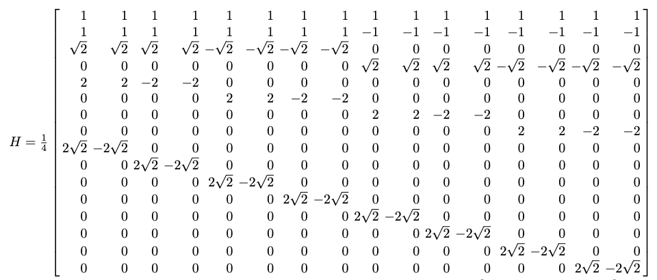
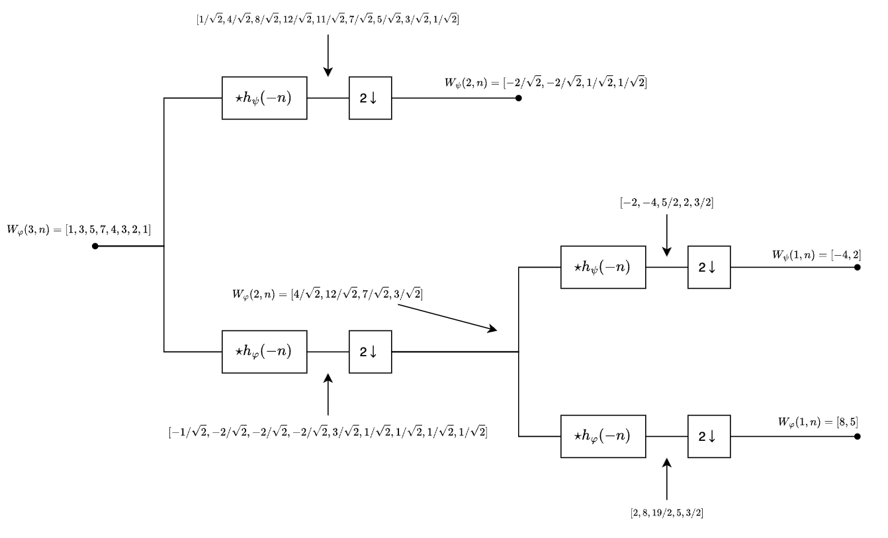
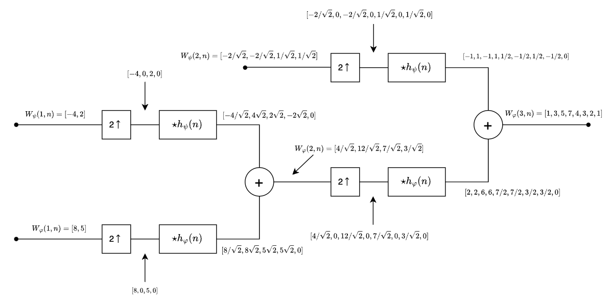

# 图像处理 HW2

## Q1

> 什么是线性移不变系统，请利用数学表达式进行定义说明。并进一步说明一旦我们了解了一个线性移不变系统对于单位脉冲的相应，就可以利用卷积计算出任意一个输入信号的系统输出。

对于一个系统$H$，如果有
$$
H[af_1(x,y)+bf_2(x,y)]=aH[f_1(x,y)]+bH[f_2(x,y)]
$$
则系统$H$是一个线性系统。之后，还对于任意的$f(x,y)$，$\alpha$和$\beta$，如果
$$
H[f(x-\alpha,y-\beta)]=g(x-\alpha,y-\beta)
$$
则输入/输出关系具有$g(x,y)=H[f(x,y)]$的算子称为线性移不变系统。

对于离散冲激函数，我们可以将$f(x,y)$表示为：
$$
f(x,y)=∫_{-\infin}^{+\infin}∫_{-\infin}^{+\infin}f(\alpha,\beta)\delta(x-\alpha,y-\beta)d\alpha d\beta
$$
带入输入/输出关系：
$$
g(x,y)=H[∫_{-\infin}^{+\infin}∫_{-\infin}^{+\infin}f(\alpha,\beta)\delta(x-\alpha,y-\beta)d\alpha d\beta]
$$
由于$H$是线性算子，故有加性：
$$
g(x,y)=∫_{-\infin}^{+\infin}∫_{-\infin}^{+\infin}H[f(\alpha,\beta)\delta(x-\alpha,y-\beta)]d\alpha d\beta
$$
由于$f(\alpha,\beta)$独立于$x$和$y$，因此使用均匀性可有：
$$
g(x,y)=∫_{-\infin}^{+\infin}∫_{-\infin}^{+\infin}f(\alpha,\beta)H[\delta(x-\alpha,y-\beta)]d\alpha d\beta
$$
这里$h(x,\alpha,y,\beta)=H[\delta(x-\alpha,y-\beta)]$称为冲激响应，此时$g(x,y)$可以改写为：
$$
g(x,y)=∫_{-\infin}^{+\infin}∫_{-\infin}^{+\infin}f(\alpha,\beta)h(x,\alpha,y,\beta)dα d\beta
$$
它表明，如果系统$H$对一个冲激的响应已知，则对于任意输入$f(α,β)$的响应可用上式来计算。换句话说，线性系统H完全可由其冲激响应来表征。

## Q2

> 已知一个退化系统的退化函数H(u,v), 以及噪声的均值与方差，请描述如何利用约束最小二乘方算法计算出原图像的估计算法。

对于一幅存在加性噪声的图像，其变换的向量-矩阵形式可以表示为：
$$
\bold g=\bold{Hf}+\bold{\eta}
$$
$\bold H$对噪声高度敏感，减少噪声敏感性问题的一种方法是以平滑度量的最佳复原的最佳复原为基础的。我们期望找到一个最小准则函数：
$$
C=\sum_{x=0}^{M-1}\sum_{y=0}^{N-1}[\nabla^2f(x,y)]^2
$$
其约束为：
$$
||\bold g -\bold{H\hat f}||^2=||\bold{\eta}||^2
$$
其中$\hat f$是为退化图像的估计。这个最佳化问题在频率域中的解决由下面的表达式给出：
$$
\hat F(u,v)=[\frac{H^*(u,v)}{|H(u,v)|^2+\gamma|P(u,v)|^2}]G(u,v)
$$
其中$\gamma$是一个参数，必须对它调整以满足约束条件，$P(u,v)$是函数
$$
p(x,y)=\begin{bmatrix}0,-1,0\\-1,4,-1\\0,-1,0\end{bmatrix}
$$
的傅里叶变换。

定义残差向量：
$$
\bold{r=g-H\hat f}
$$
可以证明$\phi(\gamma)\bold{=r^Tr=||r||^2}$是单增函数。我们需要调整$\gamma$使得
$$
\bold{||r||^2=||\eta||^2}\pm a
$$
其中$a$是一个精确度因子。鉴于单增性，可以用如下迭代方式找到$\gamma$：

1. 指定$\gamma$的一个初始值；
2. 计算$\bold{||r||}^2$；
3. 若满足上述约束，则停止；否则，若$\bold{||r||^2<||\eta||^2}-a$，则增大$\gamma$。若$\bold{||r||^2>||\eta||^2}+a$，则减小$\gamma$，然后返回步骤2.

接下来计算$\bold{||r||}^2$。根据残差的傅里叶变换：
$$
R(u,v)=G(u,v)-H(u,v)\hat F(u,v)
$$
然后通过计算$R(u,v)$的反傅里叶变换得到$r(x,y)$。随后有：
$$
\bold{||r||}^2=\sum_{x=0}^{M-1}\sum_{y=0}^{N-1}r^2(x,y)
$$
然后计算$||\eta||^2$。首先考虑噪声方差：
$$
\sigma_\eta ^2=\frac{1}{MN}\sum_{x=0}^{M-1}\sum_{y=0}^{N-1}[\eta(x,y)-m_\eta]^2
$$
其中$m_\eta=\frac{1}{MN}\sum_{x=0}^{M-1}\sum_{y=0}^{N-1}\eta(x,y)$是样本均值。根据双重求和的特点就有：
$$
||\eta||^2=MN[\sigma_\eta^2+m_\eta^2]
$$

## Q3

> 请列举出课堂讲授的各种颜色空间，并指出每个通道的含义

1. **RGB（红绿蓝）**

RGB 是一种基于加法混色的颜色模型，每个通道表示以下含义：  

* R（Red）：红色通道，表示红色分量的强度，范围通常为 0-255。

* G（Green）：绿色通道，表示绿色分量的强度，范围通常为 0-255。  
* B（Blue）：蓝色通道，表示蓝色分量的强度，范围通常为 0-255。  

2. **NTSC（国家电视标准委员会标准）**

NTSC 是一种用于电视广播的颜色编码标准，包含以下通道：  

* Y：亮度（Luminance），表示图像的亮度信息。  
* I：同相色差信号，表示橙青色调信息。  
* Q：正交色差信号，表示紫绿色调信息。 

3. **YCbCr（亮度-色度模型）**

YCbCr 是一种用于视频和图像压缩的颜色模型：  

* Y：亮度（Luminance），表示图像的灰度信息。  
* Cb：蓝色差（Blue Chroma），表示蓝色与亮度的差异。  
* Cr：红色差（Red Chroma），表示红色与亮度的差异。

4. **HSV（色相-饱和度-明度）**

HSV 是一种更符合人类感知的颜色模型：  

* H（Hue）：色相，表示颜色的基本类型，范围为 0-360 度。  
* S（Saturation）：饱和度，表示颜色的纯度或强度，范围为 0-100%。  
* V（Value）：明度，表示颜色的亮度或光强，范围为 0-100%。 

5. **CMY & CMYK（青品黄黑）**  

用于打印和印刷的减色模型：  

* C（Cyan）：青色通道，吸收红光。  
* M（Magenta）：洋红通道，吸收绿光。  
* Y（Yellow）：黄色通道，吸收蓝光。  
* K（Black）：黑色通道，用于增强对比和深度。  

6. **HSI（色相-饱和度-强度）**  

HSI 更适合图像处理和分析：  

* H（Hue）：色相，定义颜色的类型，如红、绿、蓝。  
* S（Saturation）：饱和度，表示颜色的纯度或深度。  
* I（Intensity）：强度，表示图像的亮度。

## Q4

> 如果一幅图像$f(x,y)$由于几何畸变而发生了退化，我们获得了一幅退化后的图像$g(x’,y’)$。请基于对课本相关内容的阅读，描述我们如何基于标注好的对应点$(x_{k},y_k)$，$(x_{k}',y_k')$, $k=1,2,...,n$建立起用于几何校正坐标映射关系，并进一步利用双线性插值完成对$f(x,y)$的估计$\hat f(x,y)$的计算。

首先基于多项式变换模型建立几何校正坐标映射关系。先将所有的对应点分为四个一组，每一组的四个对应点组成了一个四边形，一共产生了$n/4$组（多余点舍弃）。对于第$i$组，建立如下的线性方程组：
$$
\begin{bmatrix}x_{i1}'\\x_{i2}'\\x_{i3}'\\x_{i4}'\\ \end{bmatrix}=\begin{bmatrix}1, x_{i1},y_{i1},x_{i1}y_{i1}\\1, x_{i2},y_{i2},x_{i2}y_{i2}\\1, x_{i3},y_{i3},x_{i3}y_{i3}\\1, x_{i4},y_{i4},x_{i4}y_{i4}\\ \end{bmatrix}\begin{bmatrix}a_{i1}\\a_{i2}\\a_{i3}\\a_{i4}\\ \end{bmatrix}
$$

$$
\begin{bmatrix}y_{i1}'\\y_{i2}'\\y_{i3}'\\y_{i4}'\\ \end{bmatrix}=\begin{bmatrix}1, x_{i1},y_{i1},x_{i1}y_{i1}\\1, x_{i2},y_{i2},x_{i2}y_{i2}\\1, x_{i3},y_{i3},x_{i3}y_{i3}\\1, x_{i4},y_{i4},x_{i4}y_{i4}\\ \end{bmatrix}\begin{bmatrix}b_{i1}\\b_{i2}\\b_{i3}\\b_{i4}\\ \end{bmatrix}
$$

通过求解，解出每一个四边形区域$a$和$b$，随后对每一个四边形区域进行变换。如果这个映射导致$(x,y)$映射到的$(x',y')$不是整数，那么需要使用退化后的图像进行双线性插值，即若$(x',y')$距离$(i',j'),(i'+1,j'),(i',j'+1),(i'+1,j'+1)$四个整数点最近，那么假设$x' = i'{\prime}' + \alpha, y' = j' + β, 0 \leq \alpha, \beta \leq 1$
$$
\begin{align}
\hat f(x,y)=g(x',y')&=(1-\alpha)(1-\beta)g(i',j')+\alpha(1-\beta)g(i'+1,j')\\&+(1-\alpha)\beta g(i',j'+1)+\alpha\beta g(i'+1,j'+1)
\end{align}
$$

## Q5

> 请根据课本中Z变换的定义，证明如下结论。
>
> 1. 若$x(n)$的Z变换为$X(z)$，则$(-1)^nx(n)$的Z变换为$X(-z)$
> 2. 若$x(n)$的Z变换为$X(z)$，则$x(-n)$的Z变换为$X(\frac1z)$
> 3. 若$x(n)$的Z变换为$X(z)$，则$x(2n)$的Z变换为$\frac12[X(z^{1/2})+X(-z^{\frac12})]$

1. $X(z)=\sum_{-\infin}^{+\infin}x(n)z^{-n}$

   $(-1)^nx(n)$的Z变换为：
   $$
   \begin{align}
   \sum_{-\infin}^{+\infin}(-1)^nx(n)z^{-n}&=\sum_{-\infin}^{+\infin}(-1)^nx(n)z^{-n} \\
   &=\sum_{-\infin}^{+\infin}(-1)^{-n}x(n)z^{-n} \\
   &=\sum_{-\infin}^{+\infin}x(n)(-z)^{-n} \\
   &=X(-z)
   \end{align}
   $$

2. $x(-n)$的Z变换为：
   $$
   \begin{align}
   \sum_{-\infin}^{+\infin}x(-n)z^{-n}&=\sum_{-\infin}^{+\infin}x(m)z^{m} \\
   &=\sum_{-\infin}^{+\infin}x(m)(\frac1z)^{-m} \\
   &=X(\frac{1}z)
   \end{align}
   $$
   
3. $x(2n)$的Z变换为：
   $$
   \begin{align}\sum_{-\infin}^{+\infin}x(2n)z^{-n}\end{align}
   $$
   这时令$m=2n$，由于$Z$域中变量需要进行平方根变换，使得这里有两种可能的变换方式：

   * 原式可变换为$\sum_{-\infin}^{+\infin}x(m)(z^{1/2})^{-m}=X(z^{1/2})$
   * 原式还可变换为$\sum_{-\infin}^{+\infin}x(m)(-z^{1/2})^{-m}=X(-z^{1/2})$

   因此，将两个变换按照平均值合并，可以得到：
   $$
   \begin{align}\sum_{-\infin}^{+\infin}x(2n)z^{-n}\end{align}=\frac12[X(z^{1/2})+X(-z^{1/2})]
   $$
   

## Q6

> 若$G_1(z)=-z^{-2k+1}G_0(-z^{-1})$成立，请证明$g_1(n)=(-1)^ng_0(2k-1-n)$ 

根据Z变换时移性质：
$$
Z[g_0(n-(2k-1))]=z^{2k-1}G_0(z)
$$
令$g_{01}(n)=g_0(n-(2k-1))$，$G_{01}(z)=z^{2k-1}G_0(z)$，根据Q5第一问：
$$
Z[(-1)^ng_{01}(n)]=G_{01}(-z)
$$
再令$g_{02}(n)=(-1)^ng_{01}(n)$，$G_{02}(z)=G_{01}(-z)$，再根据Q5第二问：
$$
Z[g_{01}(-n)]=G_{02}(z^{-1})
$$
随后将所有变量代换回去：
$$
Z[(-1)^ng_{01}(-n)]=G_{01}(-z^{-1}) \\
Z[(-1)^ng_0(2k-1-n)]=-z^{2k+1}G_0(-z^{{-1}})
$$
因此也就得到：
$$
g_1(n)=Z^{-1}[G_1(z)]=(-1)^ng_0(2k-1-n)
$$

## Q7

> 假设课本中给出完美重建滤波器的正交族对应的三个滤波器间的关系式是正确的，并以此为基础，推导$h_0$，$h_1$的关系。

根据正交族关系,我们可以得到以下几个关系：
$$
h_1(n)=g_1(2k-1-n)\\
h_0(n)=g_0(2k-1-n)\\
g_1(n)=(-1)^ng_0(2k-1-n)
$$
进一步整理可以得到：
$$
g_1(n)=(-1)^nh_0(n)\\
h_1(n)=(-1)^nh_0(2k-1-n)
$$

## Q8

> 哈尔变换可以用矩阵的形式表示为：
> $$
> T=HFH^T
> $$
> 其中，$F$是一个$N\times N$变换矩阵，$T$是$N\times N$变换结果。对于哈尔变换，变换矩阵$H$包含基函数$h_k(z)$，它们在连续闭区间$z\in [0,1],k=0,1,2,...,N-1$，其中$N=2^n$。为了生成矩阵，定义整数$k$，即$k=2^p+q-1$（这里$0\le p\le n-1$，当$p=0$时$q=0$或$1$；当$p\ne 0$时，$1\le q \le 2^p$）。可得哈尔基函数为：
> $$
> h_0(z)=h_{00}(z)=\frac1{\sqrt N},z\in[0,1]
> $$
> 和
> $$
> h_k(z)=h_{pq}(z)=\frac1{\sqrt N}\left\{\begin{array}{lll}2^{p/2}, (q-1)/2^p\le z <(q-0.5/)2^p\\-2^{p/2}, (q-0.5)/2^p\le z <q/2^p\\ 
> 0, 其他,z\in[0,1]\end{array}\right.
> $$
> $N\times N$哈尔变换矩阵的第$i$行包含了元素$h_i(z)$，其中$z=\frac0N, \frac1N,...,\frac{N-1}N$。计算当$N=16$时的$H_{16}$矩阵。

首先计算$N=16$时$k,p,q$的值：

| k    | p    | q    | $(q-1)/2^p$ | $(q-0.5)/2^p$ | $q/2^p$ |
| ---- | ---- | ---- | ----------- | ------------- | ------- |
| 0    | 0    | 0    | -1          | -0.5          | 0       |
| 1    | 0    | 1    | 0           | 0.5           | 1       |
| 2    | 1    | 1    | 0           | 0.25          | 0.5     |
| 3    | 1    | 2    | 0.5         | 0.75          | 1       |
| 4    | 2    | 1    | 0           | 0.125         | 0.25    |
| 5    | 2    | 2    | 0.25        | 0.375         | 0.5     |
| 6    | 2    | 3    | 0.5         | 0.625         | 0.75    |
| 7    | 2    | 4    | 0.75        | 0.875         | 1       |
| 8    | 3    | 1    | 0           | 0.0625        | 0.125   |
| 9    | 3    | 2    | 0.125       | 0.1875        | 0.25    |
| 10   | 3    | 3    | 0.25        | 0.3125        | 0.375   |
| 11   | 3    | 4    | 0.375       | 0.4375        | 0.5     |
| 12   | 3    | 5    | 0.5         | 0.5625        | 0.625   |
| 13   | 3    | 6    | 0.625       | 0.6875        | 0.75    |
| 14   | 3    | 7    | 0.75        | 0.8125        | 0.875   |
| 15   | 3    | 8    | 0.875       | 0.9375        | 1       |

那么可以计算得到哈尔矩阵如下：

## Q9

> 以下列基本要素计算二元组$[3,2]^T$的扩展系数并写出对应的扩展：
>
> 1. 以二元实数集合$\bold R^2$为基础的$\varphi_0=[1/\sqrt2, 1/\sqrt2]^T$和$\varphi_1=[1/\sqrt2, -1/\sqrt2]^T$
> 2. 以$\bold R^2$为基础的$\varphi_0=[1,0]^T$和$\varphi_1=[1,1]^T$及其对偶$\bar \varphi_0=[1,-1]^T$和$\bar \varphi_1=[0,1]^T$
> 3. 以$\bold R^2$为基础的$\varphi_0=[1,0]^T$，$\varphi_1=[-1/2,\sqrt3/2]^T$和$\varphi_2=[-1/2,-\sqrt3/2]^T$，以及对于$i\in \{0,1,2\}$，它们的对偶$\bar \varphi_i=2\varphi_i/3$
>
> 提示：必须使用向量内积替代7.2.1节中的整数内积

1. $v=c_0\varphi_0+c_1\varphi_1$

   $c_0=\langle v, \varphi_0\rangle=\frac5{\sqrt2}$，

   $c_1=\langle v, \varphi_1\rangle=\frac1{\sqrt2}$，

   $v=\frac5{\sqrt2}\varphi_0+\frac1{\sqrt2}\varphi_1$

2. $v=c_0\varphi_0+c_1\varphi_1$

   $c_0=\langle v, \bar \varphi_0\rangle=1$，

   $c_1=\langle v, \bar\varphi_1\rangle=2$，

   $v=\varphi_0+2\varphi_1$

3. $v=c_0\varphi_0+c_1\varphi_1+c_2\varphi_2$

   $c_0=\langle v, \bar \varphi_0\rangle=[3,2]\cdot\frac23\cdot[1,0]^T=2$，

   $c_1=\langle v, \bar\varphi_1\rangle=\frac23(-\frac32+\sqrt3)$，

   $c_2=\langle v, \bar\varphi_2\rangle=\frac23(-\frac32-\sqrt3)$，

   $v=2\varphi_0+\frac23(-\frac32+\sqrt3)\varphi_1+\frac23(-\frac32-\sqrt3)\varphi_2$

## Q10

> 说明尺度函数
> $$
> \varphi(x)=\left \{ \begin{array}{ll}1 \quad0.25\le x<0.75\\ 0\quad 其他\end{array}\right.
> $$
> 并未满足多分辨率分析的第二个要求

考虑尺度函数$\varphi_{0,0}(x)=\varphi(x)\in V_0$，但在$V_1$中的函数族$\{\varphi_{1,k}\}$在$(\frac38,\frac58)$上取值一定为0，无法表示$\varphi_{0,0}$，因此$V_0\subset V_1$不成立，第二个需求不满足。

## Q11

> 式$W_\varphi(j_0,k)=\frac1{\sqrt M}\sum_xf(x)\varphi_{j_0,k}(x)$和式$W_\psi(j,k)=\frac1{\sqrt M}\sum_xf(x)\psi_{j,k}(x)$中的DWT是起始尺度$j_0$的函数
>
> 1. 令$j_0=1$，重新计算例7.8中函数$f(n)=\{1,4,-3,0\}$在区间$0\le n \le3$内的一维DWT
> 2. 使用第1问的结果，根据变换值计算$f(1)$

1. $\varphi_{1,0}(x)=\sqrt2 \varphi(2x)$，且四个点分布在$\varphi(x)$的支撑区上，那么也就是说前两个点在$\varphi_{1,0}$的支撑区上：
   $$
   \begin{align}
   W_\varphi(1,0)=\frac12(1\times\sqrt2+4\times\sqrt2+(-3)\times0+0\times0)=\frac52\sqrt2
   \end{align}
   $$
   对$\varphi_{1,1}(x)=\sqrt2 \varphi(2x-1)$
   $$
   \begin{align}
   W_\varphi(1,1)=\frac12(1\times0+4\times0+(-3)\times\sqrt2+0\times\sqrt2)=-\frac32\sqrt2
   \end{align}
   $$
    $\psi_{1,0}(i)$和$\psi_{1,1}(i)$对应的就是哈尔矩阵第3行和第4行的值：
   $$
   W_\psi(1,0)=\frac12(1\times\sqrt2+4\times(-\sqrt2)+(-3)\times0+0\times 0)=-\frac32\sqrt2 \\
   W_\psi(1,1)=\frac12(1\times0+4\times0+(-3)\times\sqrt2+0\times (-\sqrt2))=-\frac32\sqrt2
   $$
   所以一维DWT是$\{\frac52\sqrt2,-\frac32\sqrt2,-\frac32\sqrt2,-\frac32\sqrt2\}$

2. 根据公式
   $$
   f(n)=\frac12[W_\varphi(1,0)\varphi_{1,0}(n)+W_\varphi(1,1)\varphi_{1,1}(n)+W_\psi(1,0)\psi_{1,0}(n)+W_\psi(1,1)\psi_{1,0}(n)]
   $$
   因此：
   $$
   f(1)=\frac12[\frac52\sqrt2\times\sqrt2+(-\frac32)\sqrt2\times0+(-\frac32)\sqrt2\times(-\sqrt2)+(-\frac32)\sqrt2\times0]=4
   $$

## Q12

> 现在假设我们有一个长度为8的信号f=[1 3 5 7 4 3 2 1], 利用哈尔小波进行两层的快速小波变换分解，计算各层的滤波器输出，然后再进行完美重建，请利用与书中例子相同的框图进行计算。

首先有$h_\varphi(n)=[1/\sqrt2, 1/\sqrt2]$，$h_\psi(n)=[1/\sqrt2, -1/\sqrt2]$。

先来计算与$h_\varphi(-n)$的卷积，用来计算第一步$W_\varphi(2,n)$，其结果为$[1/\sqrt2,4/\sqrt2,8/\sqrt2,12/\sqrt2,11/\sqrt2,7/\sqrt2,5/\sqrt2,3/\sqrt2,1/\sqrt2]$，取出其中的偶数项：$W_\varphi(2,n)=[4/\sqrt2,12/\sqrt2,7/\sqrt2,3/\sqrt2]$

再来计算与$h_\psi(-n)$的卷积，用来计算第一步$W_\psi(2,n)$，其结果为$[-1/\sqrt2,-2/\sqrt2,-2/\sqrt2,-2/\sqrt2,3/\sqrt2,1/\sqrt2,1/\sqrt2,1/\sqrt2,1/\sqrt2]$，取出其中的偶数项：$W_\psi(2,n)=[-2/\sqrt2,-2/\sqrt2,1/\sqrt2,1/\sqrt2]$

如此完成了第一层快速小波变换分解。接下来计算第二层。

$W_\varphi(2,n)\star h_\varphi(-n)=[2,8,19/2,5,3/2]$，取偶数项$W_\varphi(1,n)=[8,5]$

$W_\varphi(2,n)\star h_\psi(-n)=[-2,-4,5/2,2, 3/2]$，取偶数项$W_\psi(1,n)=[-4,2]$

接下来进行完美重建。首先计算第一层重建

$W_\psi(1,n)$补偶数项得到$[-4,0,2,0]$，与$h_\psi(n)$做卷积，结果为$[-4/\sqrt2,4/\sqrt2,2/\sqrt2,-2/\sqrt2,0]$，

$W_\varphi(1,n)$补偶数项得到$[8,0,5,0]$，与$h_\varphi(n)$做卷积，结果为$[8/\sqrt2,8/\sqrt2,5/\sqrt2,5/\sqrt2,0]$，

两项相加并舍弃最后一项得到$W_\varphi(2,n)=[4/\sqrt2,12/\sqrt2,7/\sqrt2,3/\sqrt2]$

$W_\psi(2,n)$补偶数项得到$[-2/\sqrt2,0,-2/\sqrt2,0,1/\sqrt2,0,1/\sqrt2,0]$，与$h_\psi(n)$做卷积，结果为$[-1,1,-1,1,1/2,-1/2,1/2,-1/2,0]$，

$W_\varphi(2,n)$补偶数项得到$[4/\sqrt2,0,12/\sqrt2,0,7/\sqrt2,0,3/\sqrt2,0]$，与$h_\varphi(n)$做卷积，结果为$[2,2,6,6,7/2,7/2,3/2,3/2,0]$，

两项相加并舍弃最后一项得到$W_\varphi(3,n)=[1,3,5,7,4,3,2,1]$，完成了完美重建。

