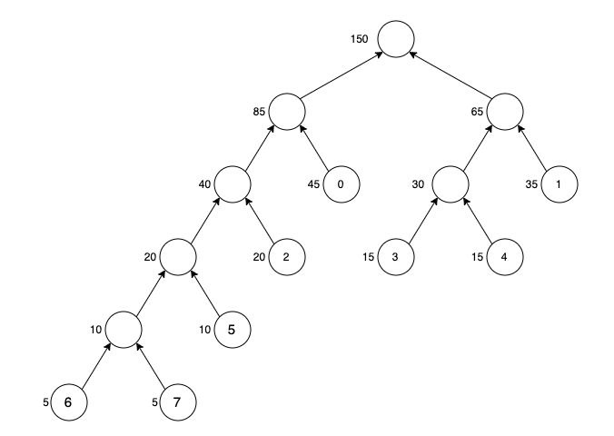
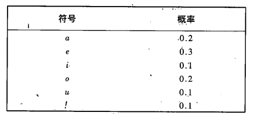

# 图像处理 HW3

## Q1

> 考虑以下一组灰度值及其在图像中出现的频率：
>
> | 灰度值 | 频率 |
> | ------ | ---- |
> | 0      | 45   |
> | 1      | 35   |
> | 2      | 20   |
> | 3      | 15   |
> | 4      | 15   |
> | 5      | 10   |
> | 6      | 5    |
> | 7      | 5    |
>
> 1. 使用霍夫曼编码为这些灰度值构造一棵最优二叉树，写出每个灰度值的霍夫曼编码，并计算使用这种编码方案对应的平均码长。
> 2. 假设原始图像使用固定长度编码，每个灰度值使用3位二进制数表示，请计算使用霍夫曼编码相比固定长度编码在存储空间上节省了多少比例。
> 3. 简要讨论霍夫曼编码在数字图像压缩中的优势与局限性。

1. 编码二叉树如下：

   

   其中假设每条边向左延伸为1，向右为0，则编码如下：

   | 灰度值 | 编码  |
   | ------ | ----- |
   | 0      | 10    |
   | 1      | 00    |
   | 2      | 110   |
   | 3      | 011   |
   | 4      | 010   |
   | 5      | 1110  |
   | 6      | 11111 |
   | 7      | 11110 |

   平均码长：
   $$
   L=\sum_{i=1}^np_il_i=2.67
   $$

2. 对于固定码长编码，当编码存储数量到达具有统计意义时，其节省空间才与哈夫曼编码有对比意义。

   固定码长编码的平均码长是3，因此空间节省比例：
   $$
   \frac{3-2.67}3=0.11=11\%
   $$

3.  优势：

   * **无损压缩**：霍夫曼编码是一种无损压缩方法，不会引入失真，适用于对图像质量要求较高的场景。
   * **编码效率高**：针对出现频率较高的符号分配较短的码字，接近熵编码的理论极限，压缩率高。
   * **实现简单**：算法简单，易于在硬件和软件中实现。
   * **广泛适用性**：常用于JPEG、PNG等图像格式，适合多种数据分布。

   局限性：

   * **依赖统计模型**：需要先统计符号出现频率，适合静态数据流，难以应对实时数据。
   * **适用性有限**：对数据分布均匀的图像（例如噪声图像），压缩效果较差。
   * **固定块编码问题**：在图像中像素间存在空间相关性，霍夫曼编码无法直接利用这些相关性。
   * **编码效率瓶颈**：熵编码理论限制了其最高压缩率，难以进一步提升。
   * **动态适应能力差**：在变化较大的图像流中，必须频繁重构码表，增加计算复杂度。

## Q2

> 算数解码过程是编码的逆过程。对给出的编码模型信息0.23355进行解码。
>
> 

逐轮迭代复原原数据，找到每个区间的6个符号分界点$s_1-s_6$

* Iter1：a和e的分界点是0.2，e和i的分界点是0.5，而0.23355在0.2-0.5内，因此第一个符号是e
* Iter2：现在的区间是0.2-0.5，(0.23355-0.2)/0.3=0.112，因此在区间的前0.112，这是a的范围0.2-0.26，因此第二个符号是a
* Iter3：现在的区间是0.2-0.26，(0.23355-0.2)/0.06=0.559，因此在区间的前0.559，这是i的范围0.23-0.236，因此第三个符号是i
* Iter4：现在的区间是0.23-0.236，(0.23355-0.23)/0.006=0.592，因此在区间的前0.592，这是i的范围0.233-0.2336，因此第四个符号是i
* Iter5：现在的区间是0.233-0.2336，(0.23355-0.233)/0.0006=0.917，因此在区间的前0.917，这是!的范围，因此第五个符号是!

因此最后的结果是eaii!

## Q3

> 名词解释：
>
> 1. 信源编码与解码器
>
> 2. 信道编码与解码器
>
> 3. 信息量/自信息
>
> 4. 熵
>
> 5. 条件熵
>
> 6. 互信息
>
> 7. 信道容量

1. **信源编码**是将原始信息转换为便于传输或存储的形式，通常通过压缩去除冗余，从而提高传输效率。**解码器**则是将编码后的信号还原为原始信息。

2. **信道编码**是在数据传输过程中引入冗余，以便在信道中发生错误时实现错误检测和纠正。**解码器**用于接收端，根据编码规则恢复和纠正数据。

3. **信息量**是对一个事件发生的不确定性的度量。**自信息**定义为事件发生时提供的信息大小，通常用对数度量：
   $$
   I(x)=-\log P(x)
   $$
    其中，$P(x)$表示事件$x$的概率。概率越小，信息量越大。

4. 熵是衡量一个系统或信源中信息不确定性或平均信息量的度量，其定义为：
   $$
   H(X)=-\sum P(x_i)\log P(x_i)
   $$
   其中，$X$表示信源的输出，$P(x_i)$表示输出可能的概率。熵越大，不确定性越高。

5. 条件熵是给定一个随机变量的情况下，另一个随机变量的平均不确定性。公式为：
   $$
   H(Y|X)=-\sum P(x_i, y_i)\log P(y_i|x_i)
   $$
   它表示在已知$X$的情况下$Y$平均剩余不确定性。

6. 互信息衡量两个随机变量之间的相互依赖程度，其定义为：
   $$
   I(X,Y)=\sum_i\sum_jP(x_i,y_j)\log\frac{P(x_i,y_j)}{P(x_i)P(y_j)}
   $$
   互信息表示一个变量中的信息有多少可以通过另一个变量来获知。

7. 信道容量是信道能够无误传输信息的最大速率，定义为最大互信息：
   $$
   C=\max_{P(X)}I(X,Y)
   $$
   其中， $C$表示信道容量，$I(X，Y)$ 表示输入和输出之间的互信息。它表示信道在噪声环境下的最大数据传输能力。

## Q4

> 海明码（7，4）是一种有名的信道纠错码。请解释说明该编码方案的编码与解码的计算方法。

主要思想：如果将3位冗余码加到4位字上，使得任意两个有效码字的距离为3，那么所有的一位错误都可以检测出来并纠正。

* 编码：

  与4位二进制数$b_3b_2b_1b_0$相联系的7位海明码字$h_1\dots h_7$是：

$$
h_1=b_3\oplus b_2\oplus b_0\quad h_3=b_3\\
h_2=b_3\oplus b_1\oplus b_0\quad h_5=b_2\\
h_4=b_2\oplus b_1\oplus b_0\quad h_6=b_1\\
 \quad \quad  \quad \quad  \quad \quad  \quad \quad \ \ h_7=b_0
$$

* 解码：

  信道解码器必须为先前设立的偶校验的各个位字段进行奇校验并检查译码值。一位错误由一个非零奇偶校验字$c_4c_2c_1$给出，其中：
  $$
  c_1=h_1\oplus h_3\oplus h_5\oplus h_7\\
  c_2=h_2\oplus h_3\oplus h_6\oplus h_7\\
  c_4=h_4\oplus h_5\oplus h_6\oplus h_7
  $$
  如果找到一个非零值，则解码器只需简单地在校验字指出的位置补充码字比特（取反）。解码的二进制值$h_3h_5h_6h_7$就从纠正的码字中提取出来。
  
## Q5

> 证明二元表达式$(A\cdot B)^c=(A^c\circ \hat B)$的正确性

$$
\begin{align}
(A\cdot B)^c &= ((A\oplus B)\ominus B)^c \\
&=(A\oplus B)^c\oplus \hat B \\
&= (A^c\ominus \hat B) \oplus\hat B \\
&= A^c\circ\hat B
\end{align}
$$

